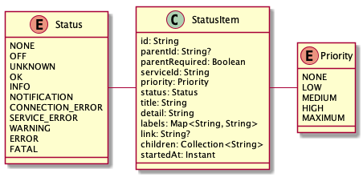
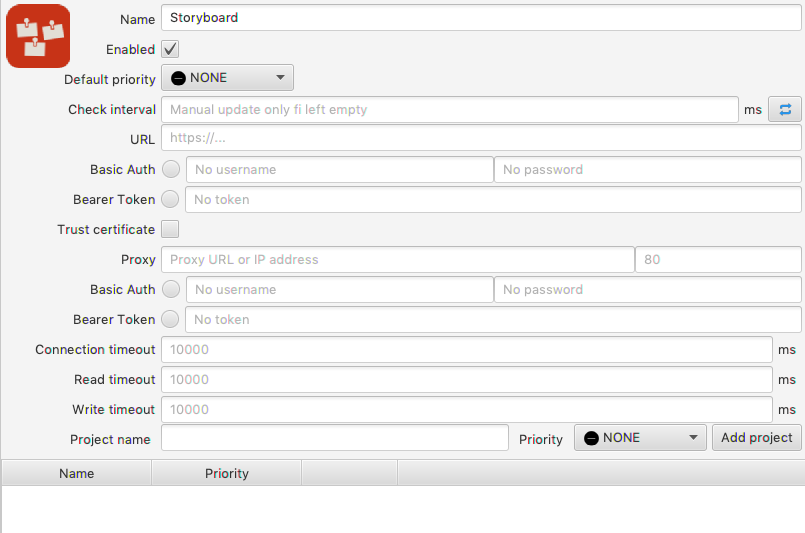

# Monitor Application

1. [ Basic Concepts ](#basic-concepts)
2. [ Priority and Status ](#priority-and-status)
3. [ Services ](#services)
4. [ Notifiers ](#notifiers)
5. [ Modules ](#modules)
     1. [ Core Modules ](#core-modules)
     2. [ Alert Manager Service ](#alert-manager-service)
     3. [ Deployment Case Notifier ](#deployment-case-notifier)
     4. [ DevOps Light Notifier ](#devops-light-notifier)
     5. [ Gerrit Code Review Service ](#gerrit-code-review-service)
     6. [ Jenkins Service ](#jenkins-service)
     7. [ JIRA Service ](#jira-service)
     8. [ Notification Tabs Notifier ](#notification-tabs-notifier)
     9. [ Notifications Notifier ](#notifications-notifier)
    10. [ Sonar Service ](#sonar-service)
    11. [ Storyboard Service ](#storyboard-service)
    12. [ System Tray Notifier ](#system-tray-notifier)

## Basic Concepts

Everything revolves around a [``StatusItem``](data/src/main/java/com/poterion/monitor/data/StatusItem.kt) in the
[``Data``](data) module. [``ServiceModules``](api/src/main/java/com/poterion/monitor/api/modules/ServiceModule.kt) have
to translate the state of their services to it and send a list of
[``StatusItems``](data/src/main/java/com/poterion/monitor/data/StatusItem.kt) to the
[``StatusCollector``](api/src/main/java/com/poterion/monitor/api/StatusCollector.kt). The
[``StatusCollector``](api/src/main/java/com/poterion/monitor/api/StatusCollector.kt) caches those
[``StatusItems``](data/src/main/java/com/poterion/monitor/data/StatusItem.kt) and notified all
[``Notifiers``](api/src/main/java/com/poterion/monitor/api/modules/NotifierModule.kt) about new updates. An 
[``StatusItem``](data/src/main/java/com/poterion/monitor/data/StatusItem.kt) is, e.g., a [Jenkins Job](jenkins), a
[Sonar Project](sonar) or an alert from [Alert Manager](alert-manager). 

Every time the collection of [``StatusItems``](data/src/main/java/com/poterion/monitor/data/StatusItem.kt) changes the
[``Notifier`` modules](api/src/main/java/com/poterion/monitor/api/modules/NotifierModule.kt) get notified. 
Depending on their capability they can display them. So for example the [``System Tray``](system-tray) module
can display only one [``StatusItem``](data/src/main/java/com/poterion/monitor/data/StatusItem.kt). Another example may 
be the [DevOps Light](https://blog.kubovy.eu/2018/02/11/status-light-with-raspberry-pi-zero-and-w2812-led-strip/)
module which can display a collection of [``StatusItems``](data/src/main/java/com/poterion/monitor/data/StatusItem.kt).
Then it presents the corresponding  light patterns and colors.

## Priority and Status

Every status item has a [``Status``](data/src/main/java/com/poterion/monitor/data/Status.kt) and
[``Priority``](data/src/main/java/com/poterion/monitor/data/Priority.kt). To understand how to configure the
application those two properties are probably the most important ones. Although each
[``Notifier``](api/src/main/java/com/poterion/monitor/api/modules/NotifierModule.kt) is free to implement its decision
making what and how to display, there are common guidelines which are followed in standard cases. To decide what is
going to be displayed by the [``Notifiers``](api/src/main/java/com/poterion/monitor/api/modules/NotifierModule.kt) the
worst [``Status``](data/src/main/java/com/poterion/monitor/data/Status.kt) is calculated. All
[``StatusItem``](data/src/main/java/com/poterion/monitor/data/StatusItem.kt) with this "worst"
[``Status``](data/src/main/java/com/poterion/monitor/data/Status.kt) are then ordered by
[``Priority``](data/src/main/java/com/poterion/monitor/data/Priority.kt). Additionally the common
[``Notifier``](api/src/main/java/com/poterion/monitor/api/modules/NotifierModule.kt) API defines, both, minimum
[``Status``](data/src/main/java/com/poterion/monitor/data/Status.kt) and minimum
[``Priority``](data/src/main/java/com/poterion/monitor/data/Priority.kt). This filter is applied before the worst
[``Status``](data/src/main/java/com/poterion/monitor/data/Status.kt) is calculated. This is a common case for
[``StatusItems``](data/src/main/java/com/poterion/monitor/data/StatusItem.kt) with the
[``Priority``](data/src/main/java/com/poterion/monitor/data/Priority.kt) "_NONE_".

## Services

Currently only REST service are implemented.

Each such service can configure the following:

  - *Name*: A name to easily identify the defined service in the UI.
  - *Enabled*: If enable, the service makes actual REST calls based on their configuration.
  - *Default priority*: In case an unknown/not configured item is found, where the
    [``Priority``](data/src/main/java/com/poterion/monitor/data/Priority.kt) cannot be determined, the
    [``Priority``](data/src/main/java/com/poterion/monitor/data/Priority.kt) defined here will be used. 
  - *Check interval*: A interval in milliseconds in which the REST calls will be made to check for new
    [``StatusItems``](data/src/main/java/com/poterion/monitor/data/StatusItem.kt). If left empty no calls will be made
    automatically, but can still be made manually, e.g., by pressing the "refresh" button.
  - *URL*: The URL of the concrete service.
    - Optionally, one of "[HTTP Basic Auth](https://tools.ietf.org/html/rfc7235)" or
      "[Bearer Token](https://tools.ietf.org/html/rfc6750)" can be used for service authorization.
  - *Proxy*: Proxy address and port.
    - Optionally, one of "[HTTP Basic Auth](https://tools.ietf.org/html/rfc7235)" or
      "[Bearer Token](https://tools.ietf.org/html/rfc6750)" can be used for proxy authorization.
  - *Connection timeout*: Optionally a non-default connection timeout in milliseconds can be specified. The default is
    10 seconds.
  - *Read timeout*: Optionally a non-default read timeout in milliseconds can be specified. The default is 10 seconds.
  - *Write timeout*: Optionally a non-default write timeout in milliseconds can be specified. The default is 10 seconds.

## Notifiers

Common settings for all [``Notifiers``](api/src/main/java/com/poterion/monitor/api/modules/NotifierModule.kt) are the
following:

  - *Name*: A name to easily identify the defined notifier in the UI.
  - *Enabled*: If enable, the notifier listens to
    [``StatusItem``](data/src/main/java/com/poterion/monitor/data/StatusItem.kt) updates.
  - *Minimum priority*: Priority filter. All [``StatusItems``](data/src/main/java/com/poterion/monitor/data/StatusItem.kt)
    with priority below than defined here will be ignored.
  - *Minumum status*: Status filter. All [``StatusItems``](data/src/main/java/com/poterion/monitor/data/StatusItem.kt)
    with status below than defined here will be ignored. This may result into an empty
    [``StatusItem``](data/src/main/java/com/poterion/monitor/data/StatusItem.kt) collection. In default case this means
    no negative [``StatusItems``](data/src/main/java/com/poterion/monitor/data/StatusItem.kt) have occured. E.g., the
    [Alert Manager](alert-manager) explicitly pushes an "OK"
    [``StatusItem``](data/src/main/java/com/poterion/monitor/data/StatusItem.kt) 
  - *Services*: By default any [``Notifier``](api/src/main/java/com/poterion/monitor/api/modules/NotifierModule.kt)
    listens to all [``Services``](api/src/main/java/com/poterion/monitor/api/modules/ServiceModule.kt). This can be
    changed by selecting one or more [``Service``](api/src/main/java/com/poterion/monitor/api/modules/ServiceModule.kt).

## Modules

### Core Modules

The core of the application is made up from [``Data``](data), [``API``](api), [``Control``](control) and [``UI``](ui)
modules. The [``Data`` module](data) contains common data classes and enums, e.g.,
[``ModuleConfig``](data/src/main/java/com/poterion/monitor/data/ModuleConfig.kt),
[``Status``](data/src/main/java/com/poterion/monitor/data/Status.kt), 
[``Priority``](data/src/main/java/com/poterion/monitor/data/Priority.kt). The [``API`` module](api) contains interface
logic, e.g., [``Module``](api/src/main/java/com/poterion/monitor/api/modules/Module.kt),
[``ServiceModule``](api/src/main/java/com/poterion/monitor/api/modules/ServiceModule.kt),
[``NotifierModule``](api/src/main/java/com/poterion/monitor/api/modules/NotifierModule.kt). The
[``Control`` module](control) puts the things together and the [``UI`` module](ui) contains some common UI elements
and specific stuff for modules which want to use UI.

Then we have a bunch of modules: [``Jenkins``](jenkins), [``Sonar``](sonar) and [``System Tray``](system-tray) among
others. The former two are [``Services``](api/src/main/java/com/poterion/monitor/api/modules/ServiceModule.kt) modules
and the last is a [``Notifier``](api/src/main/java/com/poterion/monitor/api/modules/NotifierModule.kt) module.
[``Service`` modules](api/src/main/java/com/poterion/monitor/api/modules/ServiceModule.kt)  check a status of a certain
service and lets the [``Controller``](control/src/main/java/com/poterion/monitor/control/ApplicationController.kt) know
about its one or more [``StatusItems``](data/src/main/java/com/poterion/monitor/data/StatusItem.kt) through the
[``API`` module](api). While [``Notifier`` modules](api/src/main/java/com/poterion/monitor/api/modules/NotifierModule.kt)
are notified by the [``Controller``](control/src/main/java/com/poterion/monitor/control/ApplicationController.kt) over
the [``API``](api) about [``StatusItems``](data/src/main/java/com/poterion/monitor/data/StatusItem.kt) changes and react
to them.

Some modules can be instantiated multiple times. Whether a module can be instantiated multiple times only once
(singleton) depends on its implementation.

### Alert Manager Service

[Alert manager service module](alert-manager) implements a REST Client for
[Prometheus's Alert Manager](https://prometheus.io/docs/alerting/alertmanager/). This service scrapes in a specified
interval an Alert Manager instance and translates triggered alerts into
[``StatusItems``](data/src/main/java/com/poterion/monitor/data/StatusItem.kt). A mapping between an alert's
labels/annotations and their values, and [``Priority``](data/src/main/java/com/poterion/monitor/data/Priority.kt) and
[``Status``](data/src/main/java/com/poterion/monitor/data/Status.kt) can be defined in the
[``Service``](api/src/main/java/com/poterion/monitor/api/modules/ServiceModule.kt)'s configuration. All alerts not
matching any rule will be simply ignored. Therfore it is recommended to have some kind of "_catch-all_" rule.

Additionally to the [common configuration](#services) the alert manager service defines the following:

  - *Name annotation/label*: An annotation or label which should be used for the
    [``StatusItem``](data/src/main/java/com/poterion/monitor/data/StatusItem.kt)'s name.
  - *Description*: An annotation or label which should be used for the ``StatusITem``'s description.
  - *Labels*: Comma separated list of labels which should be considered or filtered out in
    [``StatusItem``](data/src/main/java/com/poterion/monitor/data/StatusItem.kt)'s label collection.
  - *Label mapping*: A mapping between label/annotation, its value and
    [``Priority``](data/src/main/java/com/poterion/monitor/data/Priority.kt) and
    [``Status``](data/src/main/java/com/poterion/monitor/data/Status.kt). 

### Deployment Case Notifier

The [Deployment Case](deployment-case) is a HW suitcase with programmable buttons, RGB LEDs and LCD display with an USB
and Bluetooth interface. It is implemented as a
[``Notifier`` module](api/src/main/java/com/poterion/monitor/api/modules/NotifierModule.kt) although it also serves as
a trigger communicating the other direction, back to this application, which then can trigger something. This module
only implements the Bluetooth interface.

There were 2 HW implementations of this suit-case. One based on Raspberry PI and one based on Microchip's PIC18x and
BM78 module. Both use the same serial protocol and are therefore interchangeable.

See https://blog.kubovy.eu/2018/12/09/deployment-nuklear-football/ for more details.  

Additionally to the [common configuration](#notifiers) the [Deployment Case notifier](deployment-case) defines a
bluetooth address to be used to communicate with it. Security properties, i.e., pairing has to happen on he OS level
outside the monitor application.

### DevOps Light Notifier

The [DevOps Light](devops-light) is a RGB LED notification light based on WS281x protocol (other possible but not
produced). It communicates using USB or Bluetooth interface and can be configured to display different patterns based
on the [``Status``](data/src/main/java/com/poterion/monitor/data/Status.kt) and
[``Priority``](data/src/main/java/com/poterion/monitor/data/Priority.kt) of one or more
[``StatusItems``](data/src/main/java/com/poterion/monitor/data/StatusItem.kt).

See https://blog.kubovy.eu/2018/02/11/status-light-with-raspberry-pi-zero-and-w2812-led-strip/.

Additionally to the [common configuration](#notifiers) the [DevOps Light notifier](devops-light) defines the following:

  - *Bluetooth Address*: If specified, used to communicate with the DevOps Light over bluetooth. Security properties,
                         i.e., pairing has to happen on he OS level outside the monitor application.
  - *USB Port*: If specified, used to communicate with the DevOps Light over USB.
  - *Color Ordering*: Defines one of, RGB or GRB, color ordering in the WS281x protocol. This depends on the HW
                      specification of used LED strip build in the light.

### Gerrit Code Review Service

The [Gerrit code review service](gerrit-code-review) implements a scrapper to import changes, reviews and commends from
[gerrit code review](https://www.gerritcodereview.com/) instances to the monitoring application.

Additionally to the [common configuration](#services) the [gerrit code review service](gerrit-code-review) defines a
mapping between a query and [``Status``](data/src/main/java/com/poterion/monitor/data/Status.kt) with
[``Priority``](data/src/main/java/com/poterion/monitor/data/Priority.kt). The resulting list of changes from those
queries will be transformed to a list of [``StatusItems``](data/src/main/java/com/poterion/monitor/data/StatusItem.kt).

### Jenkins Service

The [Jenkins service](jenkins) implements a scrapper of [jenkins](https://jenkins.io/) jobs and transforms their
current/last status to a [``StatusItems``](data/src/main/java/com/poterion/monitor/data/StatusItem.kt).

Additionally to the [common configuration](#services) the [Jenkins service](jenkins) defines the following:

  - *Filter*: A job filter.
  - *Job mapping*:  Defines a mapping between a jenkins job and
    [``Priority``](data/src/main/java/com/poterion/monitor/data/Priority.kt).

### JIRA Service

The [JIRA service](jira) implements a scrapper of a [JIRA](https://www.atlassian.com/software/jira) instance and
transforms issues to [``StatusItems``](data/src/main/java/com/poterion/monitor/data/StatusItem.kt).

Additionally to the [common configuration](#services) the [JIRA service](jira) defines the following:

  - *Status mapping*: Mapping between status, status category (key, name, color), issue type and 
    [``Status``](data/src/main/java/com/poterion/monitor/data/Status.kt).
  - *Priority mapping*: Mapping betwen priority, issue type and
    [``Priority``](data/src/main/java/com/poterion/monitor/data/Priority.kt).
  - *List of queries*: List of queries to be used for issue gathering.

### Notification Tabs Notifier

The [Notification Tabs notifier](notification-tabs) represents
[``StatusItems``](data/src/main/java/com/poterion/monitor/data/StatusItem.kt) in a tree table in a separate tab in the
monitor application.

There are no additional configurations to the [common configuration](#notifiers).

### Notifications Notifier

The [Notifications notifier](notifications) displays new or updated
[``StatusItems``](data/src/main/java/com/poterion/monitor/data/StatusItem.kt) as popup notifications.

Additionally to the [common configuration](#notifiers) the [Notifications notifier](notifications) defines the
following:

  - *Repeat after*: Minimal time in seconds to pass between the same
    [``StatusItem``](data/src/main/java/com/poterion/monitor/data/StatusItem.kt) to be notified.
  - *Duration - [``Status``](data/src/main/java/com/poterion/monitor/data/Status.kt) mapping*: Time in seconds a
    notification with a specific [``Status``](data/src/main/java/com/poterion/monitor/data/Status.kt) should be shown
    before disappearing.

### Sonar Service

The [Sonar service](sonar) implements a scraper of [sonarqube](https://www.sonarqube.org/) and transforms the results
of a project analysis to [``StatusItems``](data/src/main/java/com/poterion/monitor/data/StatusItem.kt).

Additionally to the [common configuration](#notifiers) the [Sonar service](sonar) defines the following:

  - *Filter*:  Project filter
  - *Project mapping*: Mapping between project ID, project name and
    [``Priority``](data/src/main/java/com/poterion/monitor/data/Priority.kt). Only projects defined in this mapping
    will be considered, others will be ignored.

### Storyboard Service

The [Storyboard service](storyboard) implements a scraper of
[storyboard](https://docs.openstack.org/infra/system-config/storyboard.html) transforming stories and tasks to
[``StatusItems``](data/src/main/java/com/poterion/monitor/data/StatusItem.kt).

Additionally to the [common configuration](#notifiers) the Storyboard service defines the following:

  - *Project - [``Priority``](data/src/main/java/com/poterion/monitor/data/Priority.kt) mapping*: Mapping between
    storyboard's projects and [``Priority``](data/src/main/java/com/poterion/monitor/data/Priority.kt). Only projects
    defined in this mapping will be considered, others will be ignored. 

### System Tray Notifier

The [System Tray notifier] shows a [``StatusItem``](data/src/main/java/com/poterion/monitor/data/StatusItem.kt) in the
system tray and additionally provides a way to show/hide the main application window, control some of the applications
and display [``StatusItems``](data/src/main/java/com/poterion/monitor/data/StatusItem.kt) per service as a sub-menu.

Additionally to the [common configuration](#notifiers) the System Tray service defines the following:

  - *Refresh*: Whether the [``StatusItems``](data/src/main/java/com/poterion/monitor/data/StatusItem.kt) of services
    should be displayed and refreshed. Due to compatibility issue with MacOS, where this feature must be turned off. 

